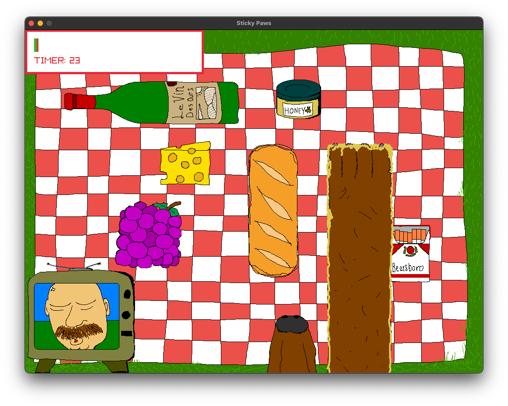

# Sticky Paws

You are a bear. You need that honey.



- A small game made with Raylib, mainly a time killer over the winter months and a good excuse to play around with C and gamedev a little bit more
- Developed on a M-series mac using Zed, all compilation done through `clang`

## How to play
- Use your mouse cursor to move your paw across the screen
- Get the jar of Honey to the bottom of the screen to win the game
- All of the objects will stick to your paw so be careful of what path you take
- Be careful not to wake up Walt, moving too fast or leaving the timer run out wakes him up!

## How to Build
- clone this repo locally, and make sure `sticky-paws` exists in a directory that also has `raylib` itself
  - some parent directory
    - `raylib`
      - the contents of https://github.com/raysan5/raylib
    - `sticky-paws`
      - this `README.md` and all other sticky-paws files
- Make sure you have cmake installed with a version > 3.5 (this is a limitation of raylib)
- Type the following command

```
cmake -S . -B build -DCMAKE_POLICY_VERSION_MINIMUM=3.5
```

- After CMake configures the project, build with:

```
cmake --build build
```

- inside the build folder is another folder named `sticky-paws` on CMakeLists.txt with the executable and `assets` directory
- cmake will automatically download a current release of raylib but if you want to use your local version you can pass -DFETCHCONTENT_SOURCE_DIR_RAYLIB=<dir_with_raylib>
